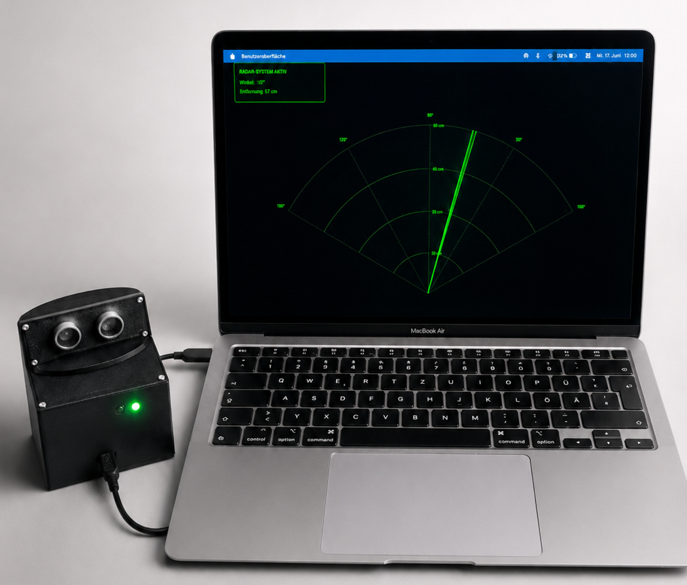

# Ultraschallradar
## Autonomes mechatronisches System zur Umfelderfassung
### Kursarbeit Automatisierungstechnik (SoSe 2026)

## Inhaltsverzeichnis
- [Projektbeschreibung](#projektbeschreibung)
- [Systemarchitektur](#systemarchitektur)
- [Verzeichnisstruktur](#verzeichnisstruktur)

## Projektbeschreibung
Das Projekt umfasst die Entwicklung und Realisierung eines **autonomen Radarsystems zur digitalen Umfelderfassung**. In der modernen Automatisierungstechnik ist eine verlässliche Nahbereichserfassung essenziell. Da optische Sensoren bei Staub, Nebel oder transparenten Oberflächen versagen, nutzt dieses System das akustische **Echo-Laufzeitverfahren (Time-of-Flight)**. 

Ein Ultraschallsensor vollführt eine kontinuierliche Schwenkbewegung und scannt die Umgebung in einem horizontalen Bereich. Die erfassten Polarkoordinaten werden an eine PC-Anwendung übertragen, mathematisch gefiltert, zu Clustern zusammengefasst und visuell auf einem Radar-Bildschirm projiziert.

### Kernmerkmale des Systems:
- **Präzise Kinematik:** Kontinuierlicher 120°-Sweep zur vollständigen Sektorenüberwachung.
- **Algorithmische Signalfilterung:** Kompensation der physikalischen Schallkegelaufweitung zur Vermeidung künstlicher Objektverbreiterungen.
- **Echtzeit-Überwachung:** Integrierter Software-Watchdog zur sofortigen Erkennung von Verbindungsabbrüchen (Hot-Plugging-Schutz).

## Systemarchitektur

### Hardware-Komponenten
- **Zentrale Steuerungseinheit:** Arduino Nano 33 BLE Sense Mikrocontroller
- **Sensorik:** HC-SR04 Ultraschall-Abstandssensor
- **Aktorik:** TowerPro SG90 Servomotor
- **Signalisierung:** Zweifarbige LED-Statusanzeige (Rot/Grün) für die Betriebszustände

### Software-Umgebung
- **Firmware:** Embedded C++ (Arduino IDE), strukturiert nach dem Doxygen-Dokumentationsstandard.
- **Frontend-Applikation:** Java-basierte Desktop-Anwendung (Processing 4.3) zur grafischen Darstellung des taktischen HUDs.

## Verzeichnisstruktur

- **`code/`**: Enthält die vollständigen Quellcodedateien.
  - `Arduino/`: Firmware für die eingebettete Hardware-Steuerung.
  - `Processing/`: Programmcode für das grafische Benutzerinterface (UI).
- **`report/`**: Beinhaltet das vollständige LaTeX-Projekt der Entwicklerdokumentation.
  - `Contents/General/`: Inhaltliche Fachkapitel (Domain Knowledge, Umsetzung, Testprotokolle).
  - `Images/General/`: Zentrales Bildverzeichnis für CAD-Modelle, Schaltungen und Fotos.
  - `tikz/`: Ausgelagerte Quelltexte der normgerechten Programmablaufpläne.